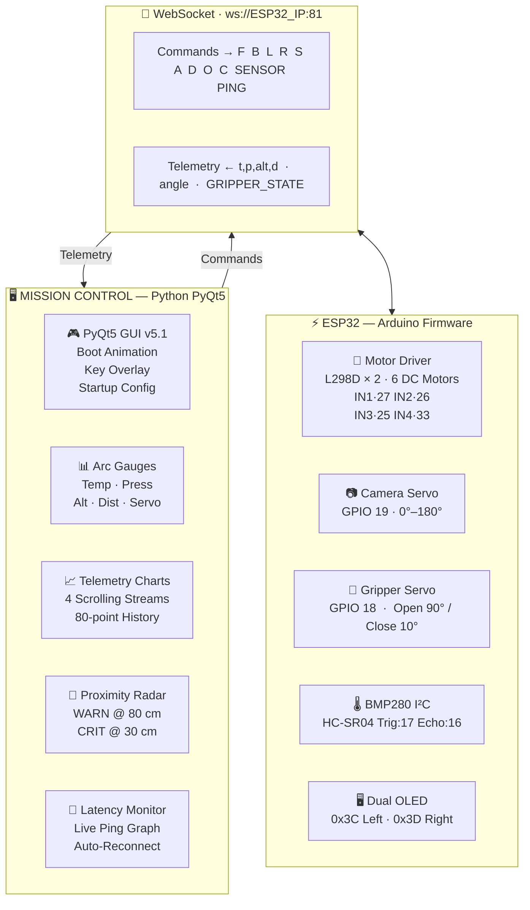

<div align="center">


<br/>


<br/><br/>


&nbsp;

&nbsp;

&nbsp;

&nbsp;

&nbsp;


<br/><br/>


</div>

---

<div align="center">

## 🛸 &nbsp; MISSION OVERVIEW

</div>

> **Mars Rover Mission Control** is a full-stack robotics project combining a custom ESP32-powered 6-wheel rover chassis with a Python PyQt5 GUI for real-time telemetry, remote driving, camera panning, and gripper control — all over Wi-Fi via WebSocket.

<div align="center">

| Icon | Feature | Description |
|:----:|---------|-------------|
| ⚙️ | **6 DC Motors** | Paired as 3 channels for tank-style differential drive |
| 📷 | **ESP32-CAM on Servo** | Live camera with 0°–180° pan control |
| 🌡️ | **BMP280 Sensor** | Real-time temperature, pressure & altitude |
| 📡 | **HC-SR04 Radar** | Ultrasonic proximity with WARN / CRIT alerts |
| 🦾 | **Servo Gripper** | Object manipulation with open/close control |
| 🟣 | **Custom PCB** | ESP32 breakout with all motor, servo & sensor headers |
| 🎮 | **Sci-fi GUI** | PyQt5 Mission Control with live charts, gauges & watchdog |

</div>

---

## 🗺️ &nbsp; SYSTEM ARCHITECTURE



---

## 🔩 &nbsp; HARDWARE COMPONENTS

<div align="center">

| # | Component | Qty | GPIO / Bus | Details |
|:---:|-----------|:---:|:----------:|---------|
| 1 | 🔵 **ESP32** DevKit / WROOM | 1 | — | Wi-Fi · WebSocket server port **81** |
| 2 | 📷 **ESP32-CAM** | 1 | Servo GPIO **19** | Mounted on pan servo · 0°–180° |
| 3 | ⚙️ **DC Gear Motors** | 6 | IN1–IN4 | Paired 3+3 wired as **2 channels** |
| 4 | 🔌 **L298D Motor Driver** | 2 | GPIO 27·26·25·33 | No Enable pin · direction only |
| 5 | 🦾 **Servo — Camera Pan** | 1 | GPIO **19** | Range 0°–180° · Step 10° |
| 6 | 🤖 **Servo — Gripper** | 1 | GPIO **18** | Open: 90° · Close: 10° |
| 7 | 📡 **HC-SR04 Ultrasonic** | 1 | Trig **17** · Echo **16** | Proximity radar 0–500 cm |
| 8 | 🌡️ **BMP280** | 1 | I²C · 0x76 / 0x77 | Temperature · Pressure · Altitude |
| 9 | 🖥️ **SSD1306 OLED 128×64** | 2 | I²C · 0x3C · 0x3D | Left: Drive state · Right: Cam + Sensors |
| 10 | 🟣 **Custom PCB** | 1 | — | ESP32 breakout · all headers populated |

</div>

### ⚡ Motor Channel Wiring

<div align="center">

| Channel | IN+ | IN− | Side | Motors |
|:-------:|:---:|:---:|:----:|:------:|
| **CH 1** | GPIO **27** | GPIO **26** | ◀ Left | 3 × DC motor (parallel) |
| **CH 2** | GPIO **25** | GPIO **33** | Right ▶ | 3 × DC motor (parallel) |

> Each channel drives **3 motors wired in parallel** — all spin together as one unit. No PWM / Enable pin needed.

</div>

---

## 🗃️ &nbsp; PIN MAPPING

<div align="center">

| Function | GPIO | Type | Notes |
|----------|:----:|:----:|-------|
| `IN1` — Left Motor Forward | **27** | Digital Out | Left motor group |
| `IN2` — Left Motor Reverse | **26** | Digital Out | Left motor group |
| `IN3` — Right Motor Forward | **25** | Digital Out | Right motor group |
| `IN4` — Right Motor Reverse | **33** | Digital Out | Right motor group |
| Camera Servo Signal | **19** | PWM | 0°–180° · step 10° per command |
| Gripper Servo Signal | **18** | PWM | 10° = closed · 90° = open |
| Ultrasonic `TRIG` | **17** | Digital Out | HC-SR04 trigger pulse |
| Ultrasonic `ECHO` | **16** | Digital In | HC-SR04 echo receive |
| BMP280 `SDA` | SDA | I²C | Shared I²C bus |
| BMP280 `SCL` | SCL | I²C | Shared I²C bus |
| OLED Left `0x3C` | SDA / SCL | I²C | Drive state animation |
| OLED Right `0x3D` | SDA / SCL | I²C | Camera gauge + sensor readout |

</div>

---

## 💻 &nbsp; SOFTWARE STACK

<div align="center">


<br/><br/>

| Layer | Technology | Details |
|:-----:|-----------|---------|
| 🎮 **GUI** | Python 3 + PyQt5 v5.1 | Sci-fi Mission Control · Boot anim · Keyboard overlay |
| 📡 **Communication** | WebSocket | `websocket-client` ↔ `WebSocketsServer` (port 81) |
| ⚡ **Firmware** | Arduino C++ / ESP32 | Motor · Servo · Sensor · OLED control loop |
| 🌡️ **Sensor Library** | Adafruit BMP280 | Temperature · Pressure · Altitude |
| 🖥️ **Display Library** | Adafruit SSD1306 + GFX | Dual OLED animated panels |
| 🦾 **Servo Library** | ESP32Servo | Smooth sweep movement |

</div>

---

## 🎮 &nbsp; GUI FEATURES

<div align="center">

| Panel | What It Shows | Details |
|:-----:|--------------|---------|
| 📊 **Arc Gauges** | 4 animated dials | Temperature · Pressure · Altitude · Distance |
| 📈 **Telemetry Charts** | Scrolling line charts | 80-point history · 4 live data streams |
| 🔴 **Proximity Radar** | Concentric ring display | ⚠️ WARN @ **80 cm** &nbsp;·&nbsp; 🚫 CRIT @ **30 cm** |
| 📶 **Latency Monitor** | Bar graph ping history | Color-coded green / amber / red by latency |
| 📷 **Camera Panel** | Servo arc gauge | `A` ← pan left &nbsp;&nbsp; pan right → `D` |
| 🦾 **Gripper Panel** | Position indicator | `O` → Open &nbsp;&nbsp; `C` → Close |
| 🤖 **Rover Visualizer** | Animated state renderer | IDLE · FORWARD · BACKWARD · TURN L/R |
| 🕹️ **D-Pad Widget** | On-screen controller | Highlights active direction in real time |
| 📋 **Mission Log** | Timestamped event log | Auto-scrolling · last 50 events |
| 📡 **Status Bar** | Connection indicator | Signal bars · Ping ms · Clock |

</div>

### ✨ Special Features

<div align="center">

| Feature | Description |
|---------|-------------|
| 🚀 **Animated Boot Sequence** | 17-stage POST initialization with animated progress bar |
| 🔗 **Startup Config Dialog** | Enter ESP32 IP at launch — no code editing needed |
| ⌨️ **Keyboard Shortcut Overlay** | Press `?` to toggle semi-transparent full-screen help panel |
| 🛡️ **Safety Watchdog** | Auto-stop motors after **3 s** of no key input |
| 🛑 **Instant Stop** | `S` sent on key release — bypasses all async queues |
| 🌐 **Hex-Grid Background** | Animated sci-fi background with depth-layered vignette |

</div>

---

## ⌨️ &nbsp; KEYBOARD CONTROLS

<div align="center">

| Key | Action | Category |
|:---:|--------|:--------:|
| `↑` | Drive **Forward** | 🚗 Movement |
| `↓` | Drive **Backward** | 🚗 Movement |
| `←` | **Turn Left** | 🚗 Movement |
| `→` | **Turn Right** | 🚗 Movement |
| *(release any arrow)* | ⚡ **Instant Stop** | 🛑 Safety |
| `A` | Camera pan **Left** | 📷 Camera |
| `D` | Camera pan **Right** | 📷 Camera |
| `O` | **Open** gripper | 🦾 Gripper |
| `C` | **Close** gripper | 🦾 Gripper |
| `?` | Toggle keyboard overlay | ℹ️ App |
| `ESC` | Exit application | ℹ️ App |

</div>

---

## 📡 &nbsp; WEBSOCKET COMMAND PROTOCOL

<div align="center">

| Command | Direction | Action |
|:-------:|:---------:|--------|
| `F` | GUI → ESP32 | 🟢 Move Forward |
| `B` | GUI → ESP32 | 🟡 Move Backward |
| `L` | GUI → ESP32 | 🔵 Turn Left |
| `R` | GUI → ESP32 | 🔵 Turn Right |
| `S` | GUI → ESP32 | 🔴 **INSTANT STOP** |
| `A` | GUI → ESP32 | 📷 Camera pan left |
| `D` | GUI → ESP32 | 📷 Camera pan right |
| `O` | GUI → ESP32 | 🦾 Open gripper |
| `C` | GUI → ESP32 | 🦾 Close gripper |
| `SENSOR` | GUI → ESP32 | 🌡️ Request sensor reading |
| `PING` | GUI → ESP32 | 📶 Latency measurement |
| `t,p,alt,d` | ESP32 → GUI | 📊 Sensor telemetry (CSV) |
| `<angle>` | ESP32 → GUI | 📷 Camera position (integer) |
| `GRIPPER_OPEN` | ESP32 → GUI | 🦾 Gripper state confirm |
| `GRIPPER_CLOSE` | ESP32 → GUI | 🦾 Gripper state confirm |

</div>

---

## 🚀 &nbsp; GETTING STARTED

### 1️⃣ &nbsp; Flash the ESP32

**Install these Arduino Libraries:**

<div align="center">

| Library | Install Via | Purpose |
|---------|:-----------:|---------|
| `ESP32Servo` | Library Manager | Servo motor control |
| `WebSockets` by Markus Sattler | Library Manager | WebSocket server |
| `Adafruit BMP280` | Library Manager | Temperature & pressure |
| `Adafruit SSD1306` | Library Manager | OLED display driver |
| `Adafruit GFX Library` | Library Manager | Graphics primitives |

</div>

**Update credentials** in `firmware/mars_rover_esp32.ino`:
```cpp
const char* ssid     = "YOUR_WIFI_SSID";
const char* password = "YOUR_WIFI_PASSWORD";
```

> Flash via Arduino IDE. The IP address appears on the **left OLED** after connecting to Wi-Fi.

---

### 2️⃣ &nbsp; Run the Python GUI

```bash
# Install Python dependencies
pip install PyQt5 websocket-client

# Launch Mission Control
python mars_rover_gui.py
```

Enter your rover's IP in the startup dialog:
```
ws://192.168.x.x:81
```

---

## 📁 &nbsp; PROJECT STRUCTURE

```
mars-rover/
├── 📁 firmware/
│   └── mars_rover_esp32.ino      ← ESP32 Arduino firmware
├── 📁 gui/
│   └── mars_rover_gui.py         ← Python PyQt5 Mission Control v5.1
├── 📁 hardware/
│   ├── pcb/                      ← KiCad PCB design files
│   └── cad/                      ← SolidWorks 3D model files
├── 📁 docs/
│   ├── pcb_layout.png
│   └── rover_3d.png
└── README.md
```

---

## 🛡️ &nbsp; SAFETY FEATURES

<div align="center">

| Feature | Trigger | Response |
|---------|:-------:|----------|
| ⚡ **Instant Stop** | Key released | `S` sent immediately · bypasses async queue |
| ⏱️ **GUI Watchdog** | No key input > **3 s** | Auto-sends `S` · resets state to IDLE |
| ⏱️ **ESP32 Watchdog** | No command > **500 ms** | Hardware-level motor cutoff |
| 🔄 **Auto-Reconnect** | Link dropped | GUI retries every **2 s** automatically |
| ⚠️ **Obstacle Warning** | Distance < **80 cm** | Yellow pulsing alert + log entry |
| 🚫 **Obstacle Critical** | Distance < **30 cm** | Red pulsing alert + log entry |

</div>

---

## 🖥️ &nbsp; OLED DISPLAY PANELS

<div align="center">

| OLED | I²C Address | Displays | Animation Style |
|:----:|:-----------:|----------|----------------|
| **Left** | `0x3C` | Drive state (IDLE / FWD / REV / TURN L / TURN R) | Pulse rings · motion lines · turn arcs |
| **Right** | `0x3D` | Camera gauge + BMP280 + HC-SR04 + Gripper status | Sweeping servo arc · scan line |

</div>

> Both OLEDs run a **welcome animation** on boot: border reveal → particle burst → countdown → **GO!** splash

---

## 🤝 &nbsp; CONTRIBUTING

```bash
git checkout -b feature/my-feature
git commit -m "Add my feature"
git push origin feature/my-feature
# Then open a Pull Request on GitHub
```

---

## 📄 &nbsp; LICENSE

This project is licensed under the **MIT License** — see [`LICENSE`](LICENSE) for details.

---

## 📊 &nbsp; REPO STATS

<div align="center">


<br/><br/>


&nbsp;

&nbsp;


</div>

---

<div align="center">


</div>
